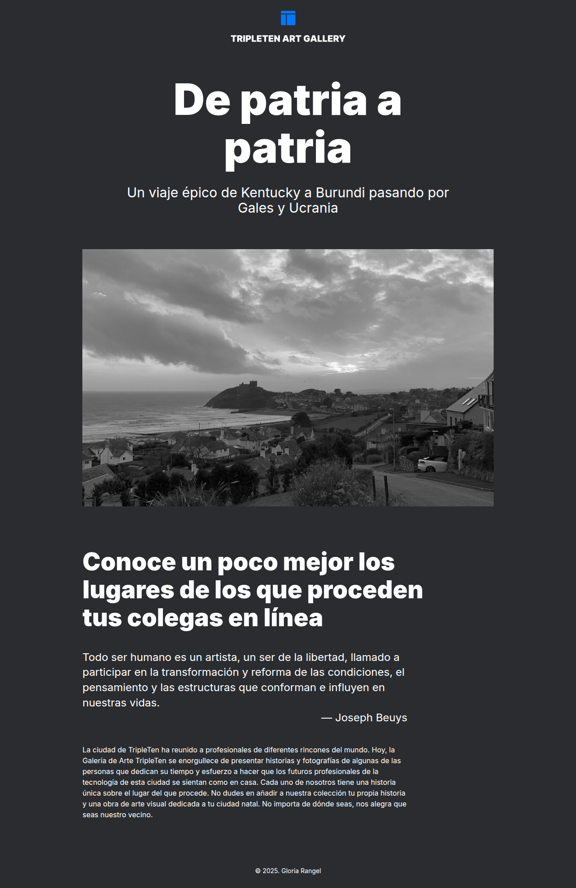

# De patria a patria 🌍✈️

## 📝 Descripción del proyecto

**"De patria a patria"** es una página web responsiva creada como parte del quinto proyecto del bootcamp de desarrollo web de [TripleTen](https://tripleten.com/). El sitio está diseñado para simular una plataforma informativa que destaca la variedad de nacionalidades de las personas y profesionales ligados a TripleTen.

### 🖱️ Funcionalidades implementadas:
- Diseño responsivo con media queries para resoluciones de **1280px**, **768px** y **pantallas móviles**.
- Estructura clara con uso de HTML5 semántico para accesibilidad mejorada.
- Estilos organizados mediante la metodología BEM.

### 💻 Tecnologías utilizadas:
- HTML5
- CSS3
- Metodología BEM
- Media queries para diseño adaptativo

### 🚀 Despliegue
Puedes ver el proyecto en línea accediendo a través del siguiente enlace:

🔗 [https://norimnori.github.io/web_project_homeland/](https://norimnori.github.io/web_project_homeland/)

### 📷 Captura de pantalla:

## 💡 Planes de mejora

A futuro, me gustaría implementar las siguientes mejoras:

- Añadir interactividad con JavaScript, como sliders para las historias o botones de "leer más".
- Reestructurar los estilos con preprocesadores como SASS. 
- Incluir soporte para múltiples idiomas.
- Mejorar la accesibilidad del sitio con mejores etiquetas ARIA.
- Agregar animaciones para mejorar la experiencia del usurio.
-  Incorporar galería de todas la ciudades y una descripción de cada una.

---

Este proyecto no solo reforzó mis habilidades en diseño responsivo y buenas prácticas de maquetado, sino que también me ayudó a entender la importancia de construir interfaces inclusivas y preparadas para escalar hacia proyectos más dinámicos.
